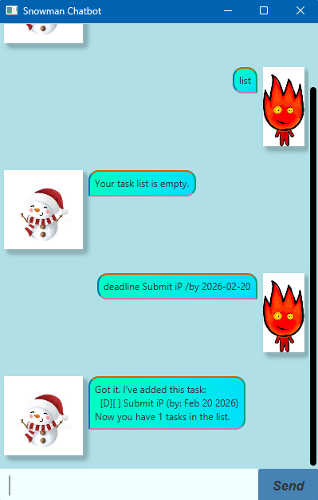

# Snowman User Guide

*Snowman Chatbot* is a desktop app for managing tasks. 
While tasks can get messy to handle, Snowman will help you to organize your tasks
so that you won't be in such a hot-headed mess!

# Quick Start
1. Ensure you have Java 17 or above installed in your Computer.
2. Download the latest .jar file from [here](https://github.com/FacelessSnowman/ip/blob/master/snowman.jar)
3. Copy the file to the folder you want to use as the home folder.
4. Open a command terminal, `cd` into the folder you put the jar file in, and use the `java -jar snowman.jar` command to run the application.

# Features
1. `list`
- Shows all tasks in your list.
2. `todo <description>`
- Adds a todo task to your list.

Example: `todo Submit iP`
3. `deadline <description> /by <date/time>`
- Adds a deadline task.
- `/by` is required and date-time format should be "YYYY-MM-DD".

Example: `deadline Submit iP /by 2026-02-20`
4. `event <description> /from <start> /to <end>`
- Adds an event task.
- `/from` is required and date-time format should be "YYYY-MM-DD".
- `/end` is required and date-time format should be "YYYY-MM-DD".

Example: `event finish iP /from 2026-02-14 /to 2026-02-20`
5. `mark <task number>`
- Marks a task as done.
- Task number should be within the list.
6. `unmark <task number>`
- Marks a task as not done.
- Task number should be within the list.
7. `delete <task number>`
- Deletes a task from the list.
- Task number should be within the list.
8. `find <keyword>`
- Finds tasks containing the keyword.
- Works for both numeric and text values.

Example: `find submit`, `find 2026`
9. `help`
- Shows the help message in the chatbot.
10. `bye`
- Exits the application.

# Editing the data file
Snowman Chatbot data is saved automatically in `data/storage.txt` as a text file. The chatbot will automatically load the 
tasks saved in `storage.txt` into the list.